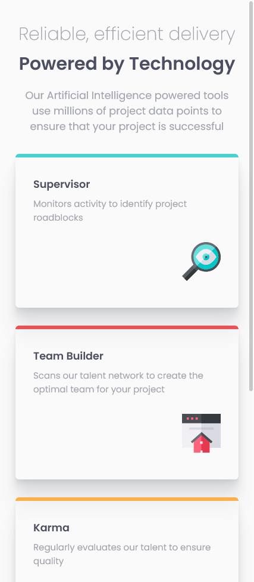
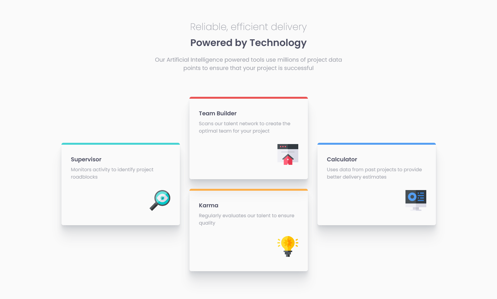

# Frontend Mentor - Four card feature section solution

This is a solution to the [Four card feature section challenge on Frontend Mentor](https://www.frontendmentor.io/challenges/four-card-feature-section-weK1eFYK). Frontend Mentor challenges help you improve your coding skills by building realistic projects. 

## Table of contents

- [Frontend Mentor - Four card feature section solution](#frontend-mentor---four-card-feature-section-solution)
  - [Table of contents](#table-of-contents)
  - [Overview](#overview)
    - [The challenge](#the-challenge)
    - [Screenshot](#screenshot)
    - [Links](#links)
  - [My process](#my-process)
    - [Built with](#built-with)
    - [What I learned](#what-i-learned)
  - [Author](#author)

## Overview

### The challenge

Users should be able to:

- View the optimal layout for the site depending on their device's screen size

### Screenshot

Mobile view

Desktop view

### Links

- Solution URL: [Github](https://github.com/gylim0604/FrontendMentor-four-card-feature-section)
- Live Site URL: [Vercel](https://frontend-mentor-four-card-feature-section-sooty.vercel.app/)

## My process

### Built with

- Semantic HTML5 markup
- Flexbox
- Sass
- Mobile-first workflow

### What I learned

For this challenge, I mostly wanted to try out Sass. I was able to get more familiar with how it works but there is still alot of room to learn. I should probably use it in a more complex challenge. Anyways, that's mostly it.

## Author

- Frontend Mentor - [@gylim0604](https://www.frontendmentor.io/profile/gylim0604)